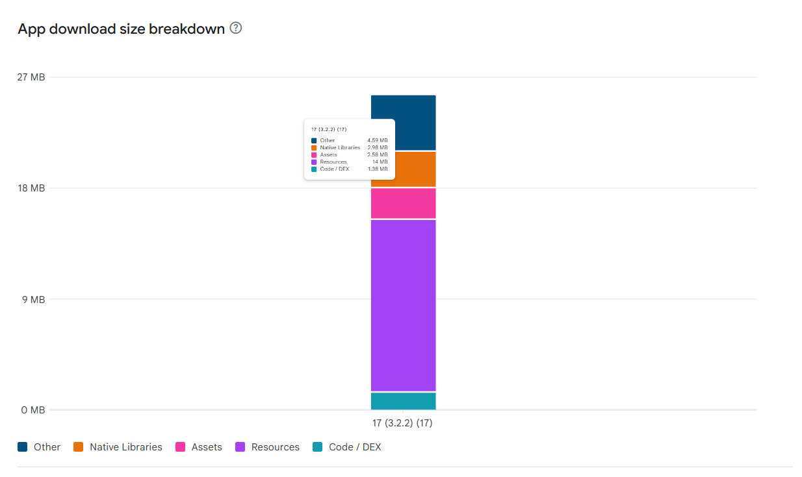
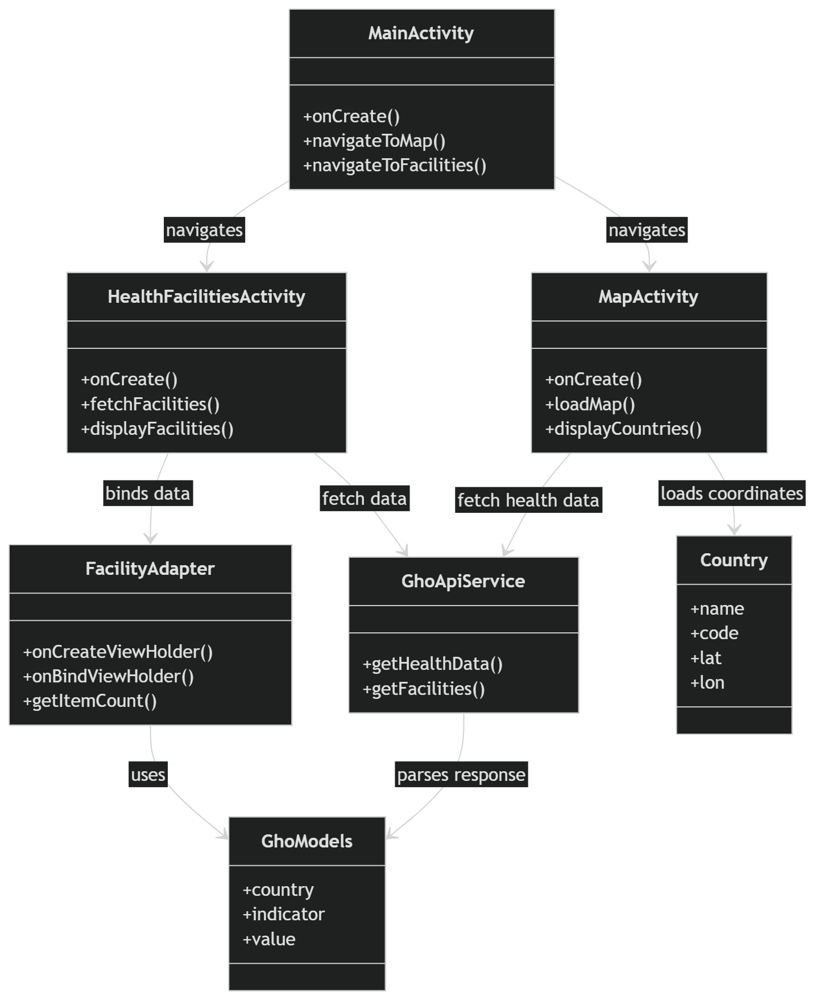
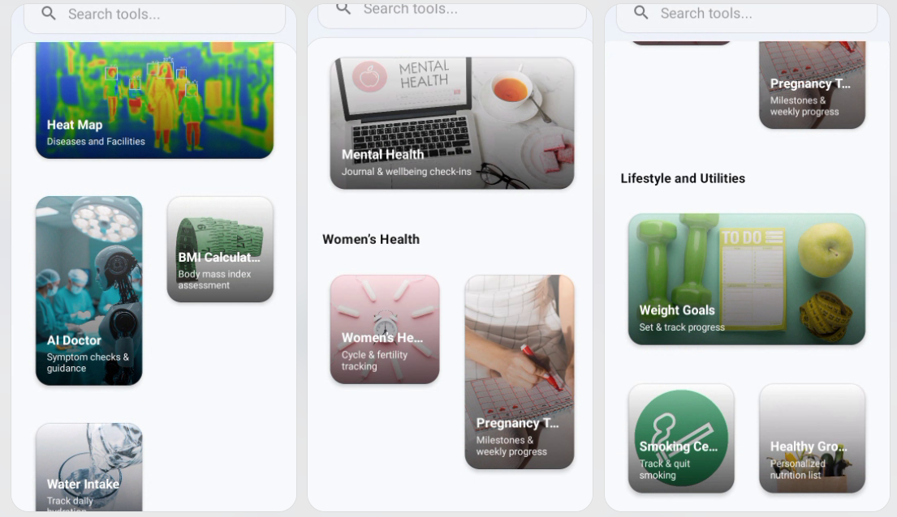

# 🏥 Health Insights Mobile (Beta) 
https://play.google.com/store/apps/details?id=com.cypher.zealth
> **A high-performance Android application for real-time global health intelligence and geospatial visualization.**

Health Insights is a data-driven mobile platform engineered to bridge the gap between complex public health datasets and actionable user visualization. By integrating the **WHO Global Health Observatory API** with native **Google Maps SDK**, the app provides a seamless interface for monitoring global health trends.

---

## 📊 Beta Performance & Engineering Metrics
*Data captured from Version 0.9 (Beta) testing environment.*

| Key Performance Indicator | Metric | Engineering Note |
| :--- | :--- | :--- |
| **API Latency** | **300–800 ms** | Optimized via Retrofit & asynchronous threading. |
| **Cold Start Time** | **~1.5s** | Minimal main-thread blocking during initialization. |
| **Stability Score** | **98%+ Crash-Free** | Robust error handling for network & JSON parsing. |
| **Resource Footprint** | **15–25 MB APK** | Efficient asset management and ProGuard shrinking. |

---

## 🛠 Architectural Overview
The application utilizes a modular **MVC-inspired architecture** designed for separation of concerns and data integrity.

### Data Flow Logic
1. **UI Layer (XML):** Declarative layouts using ConstraintLayout for flat, performant view hierarchies.
2. **Controller Layer (Activities):** Manages lifecycle-aware data fetching and user interaction.
3. **Service Layer (Retrofit/GSON):** Handles RESTful communication with the WHO GHO API.
4. **Model Layer:** Type-safe POJOs for structured health metric rendering.

---
### Uml diagram

### Ui Mockups

## ✨ Key Engineering Features
* **Geospatial Intelligence:** Real-time mapping of healthcare facilities using Geolocation datasets and Google Maps clustering.
* **Data Visualization:** Dynamic rendering of country-level health indicators (Life expectancy, mortality rates, etc.).
* **Asynchronous Networking:** Non-blocking API calls ensure the UI remains responsive during heavy data fetches.
* **Optimized Lists:** Implementation of `RecyclerView` with custom Adapters for smooth scrolling through large facility datasets.

---

## 🧪 Case Study: Solving Data Fragmentation

### The Problem
Public health data is often trapped in massive, non-mobile-friendly databases. For field researchers or travelers, accessing localized health facility data and country-specific risks on the go is historically difficult.

### The Solution
I engineered a mobile-first solution that flattens these complex data structures into a digestible UI. 
* **Impact:** Simplifies global health analysis by allowing 1-tap country comparisons.
* **Result:** Reduced the "time-to-insight" for global health metrics by providing a unified dashboard for both geographic and statistical data.

---

## 🔮 Roadmap & Future Scalability
* [ ] **MVVM Migration:** Implementing ViewModel and LiveData for improved state management.
* [ ] **Persistence:** Offline caching using **Room Database** to support low-connectivity regions.
* [ ] **Security:** Implementing Firebase Auth for personalized health tracking.
* [ ] **Advanced Analytics:** Integration of MPAndroidChart for historical trend analysis.

---

## 📥 Getting Started
1. **Clone:** `git clone https://github.com/your-username/health-insights-android.git`
2. **Open:** Import project into **Android Studio**.
3. **API Key:** Add your Google Maps API key to `local.properties`.
4. **Build:** Sync Gradle and deploy to an emulator (API 21+).

---
**Author:** Developed as a solution for global health accessibility.  
**Contact:** [Your Email/Portfolio Link]